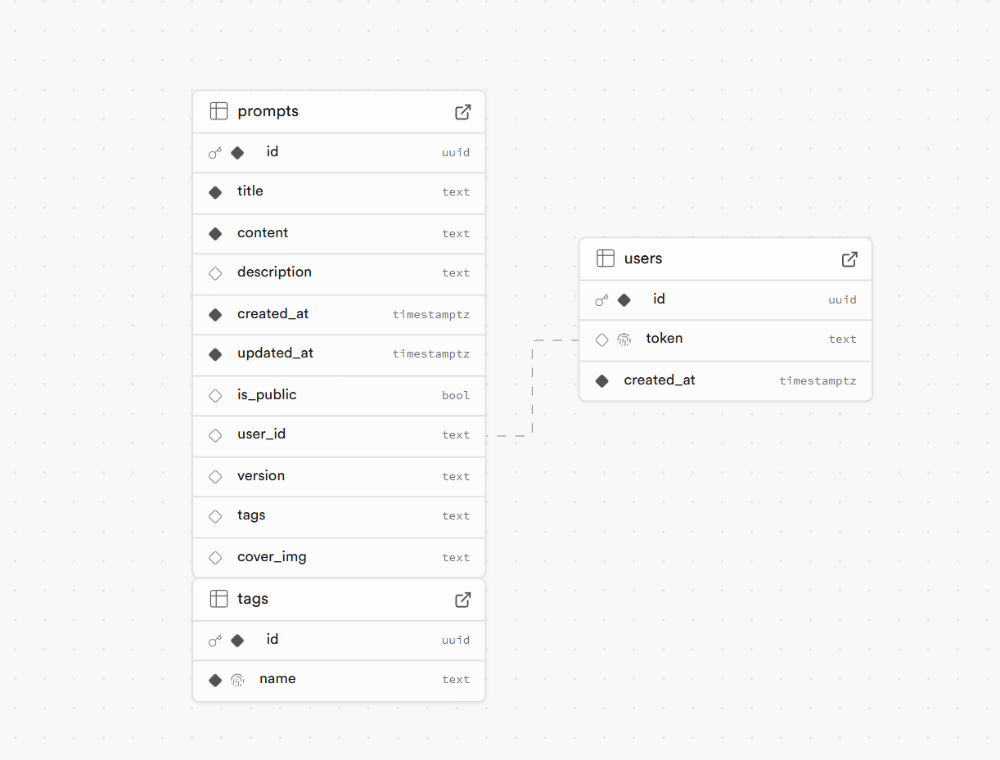

# PromptManager

一个简洁、美观、实用的提示词管理网站。

## 特性

- 简洁美观的界面设计
- 完全开源，可以自行部署和修改
- 支持提示词标签
- 支持提示词版本管理
- 移动端适配
- 简化的登录系统，使用毫无压力

## 技术栈

- Next.js 14
- Tailwind CSS
- Lucide
- Shadcn/UI
- Supabase

## 部署流程

### vercel

1. fork本项目
2. 注册并登录vercel
3. 点击`New Project`
4. 选择`Import Git Repository`
5. 输入项目名称，选择`GitHub`作为代码来源
6. 点击`Deploy`

#### 环境变量说明

- `SUPABASE_URL`：Supabase URL
- `SUPABASE_ANON_KEY`：Supabase anon key

### supabase

1. 注册supabase账号并创建项目
2. 进入项目设置，点击`Service Role`，点击`Generate new key`，复制key
3. 将key填入vercel的环境变量中
4. 进入项目设置，点击`Database`，点击`Create new database`，创建数据库
5. 创建数据表

数据表如下：

### 登录
在supabase中的users表中创建一条数据，就是一个用户，使用token登录即可。